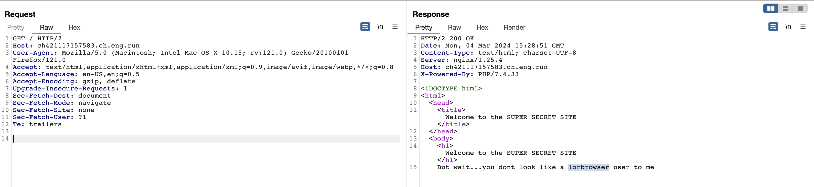
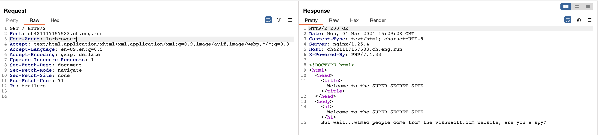
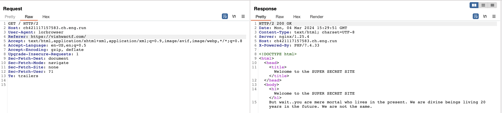
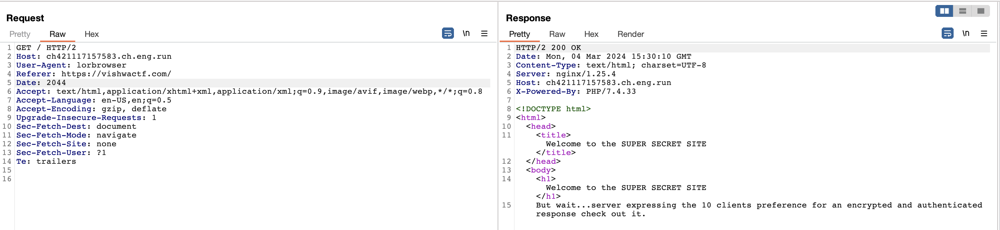
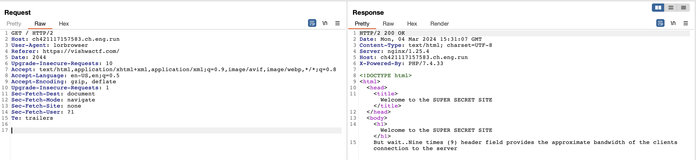
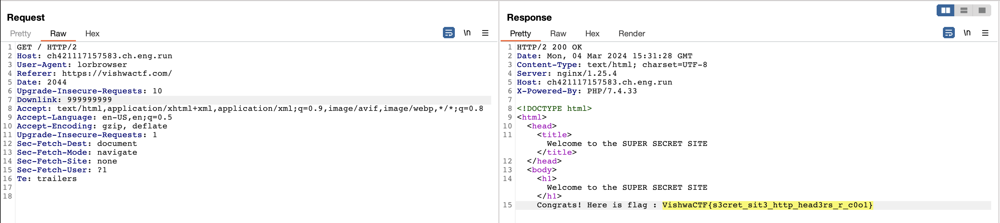

# H34D3RS

## Description

Name of the challenge says something.

# Solution:

- **User Agent:**
  Utilizing the description mentioning "lorbrowser", I set the User-Agent header to "lorbrowser", which successfully worked.

- **Referer:**
  As per the clue indicating that "wlmac people only come from vishwactf.com", I set the Referer header to "https://vishwactf.com/", gaining access.

- **Date:**
  Referring to the clue about being "20 years ahead", I attempted to set the Date header to "2044", which surprisingly worked.

- **Clients:**
  Searching for headers related to bandwidth, I discovered the Upgrade-Insecure-Requests header, and setting it to "10" as per the description, granted access.

- **Downlink:**
  The clue mentioning the "Nine times (9) header field provides the approximate bandwidth of the client's connection" led me to set the Downlink header to "999999999", successfully revealing the flag.

> Flag: VishwaCTF{s3cret_sit3_http_head3rs_r_c0o1}