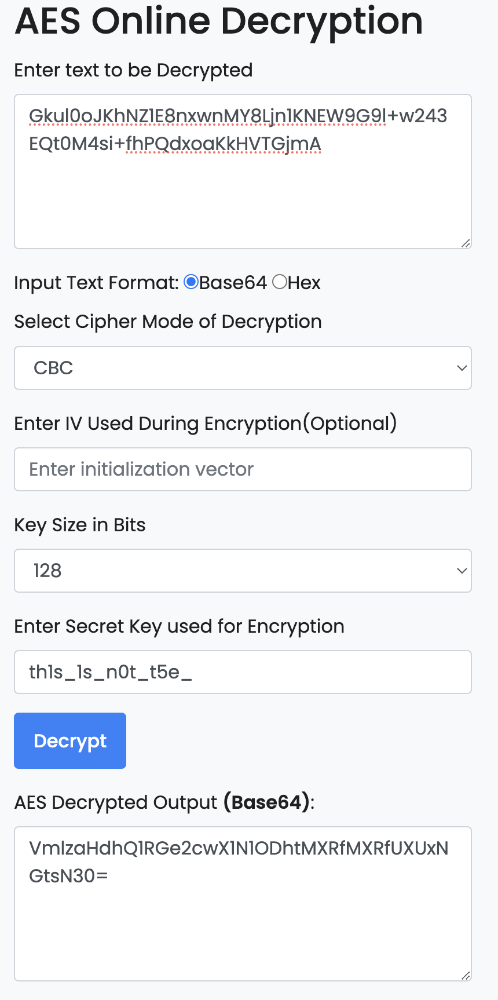

# They Are Coming

## Description

Prepare yourselves for the imminent threat! An aesthetically pleasing army of 128 Robots, armed with AGI capabilities, is on the march to destroy our locality!

## Solution:

1. **Locating `/robots.txt`**: 
    ```plaintext
    # https://www.robotstxt.org/robotstxt.html
    User-agent: *
    Disallow: /admin
    L3NlY3JldC1sb2NhdGlvbg==
    Decryption key: th1s_1s_n0t_t5e_f1a9
    ```
   The base64 encoded string `L3NlY3JldC1sb2NhdGlvbg==` translates to `/secret-location`, but upon visiting the path, it yields nothing.

2. **JavaScript Revelation**:
    ```javascript
    localStorage.setItem("userRole", "admin");
    localStorage.setItem("F1ag", "Open Your Eyes!");
    localStorage.setItem("lastLogin", "2023-01-01T12:00:00Z");
    localStorage.setItem("theme", "dark");
    localStorage.setItem("language", "en_US");
    localStorage.setItem("isLoggedIn", "true");
    localStorage.setItem("unreadMessages", "5");
    localStorage.setItem("preferredCurrency", "USD");
    return localStorage.setItem("DivID", "205"),
           localStorage.setItem("Flag", "Gkul0oJKhNZ1E8nxwnMY8Ljn1KNEW9G9l+w243EQt0M4si+fhPQdxoaKkHVTGjmA"),
           localStorage.setItem("AppVer", "1.0");
    ```
   Here, the encrypted flag is stored in the local storage. Note the encrypted flag.

3. **Decryption Clues**:
   Utilizing the information obtained from `/robots.txt` (`Decryption key: th1s_1s_n0t_t5e_f1a9`) and the JavaScript code (`children: "I have done 128 CBC tests"`), it suggests the usage of AES 128 CBC encryption.

4. **Decrypting the Flag**:
   Decrypt the flag using AES 128 CBC decryption. Tools like [https://www.devglan.com/online-tools/aes-encryption-decryption](https://www.devglan.com/online-tools/aes-encryption-decryption) can be employed for this purpose. 



> Flag: VishwaCTF{g0_Su88m1t_1t_Qu14kl7}