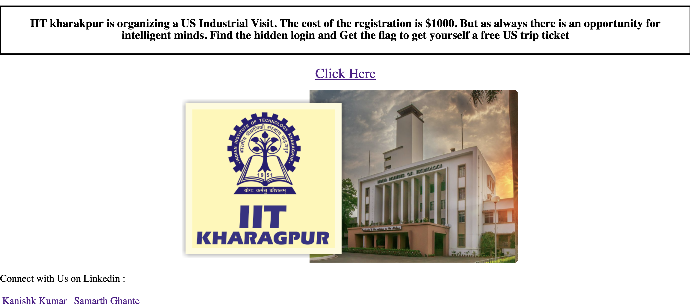
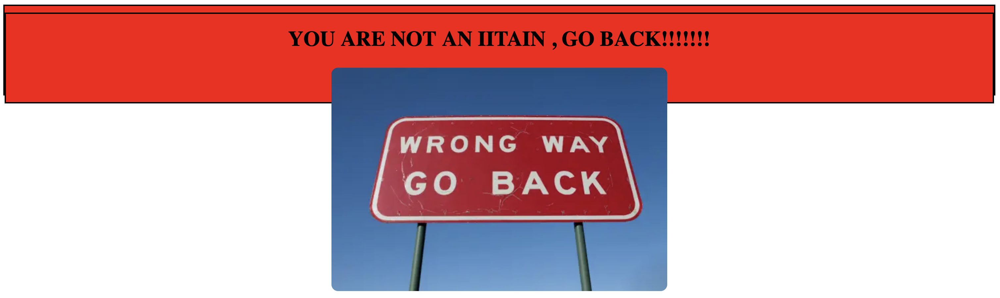
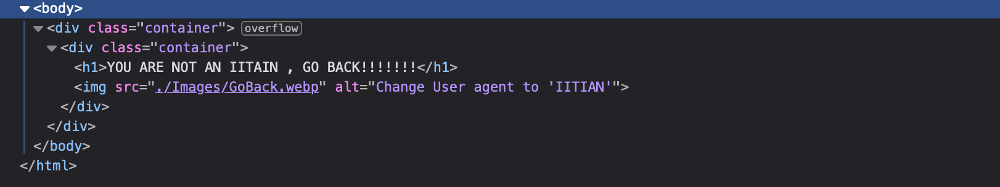
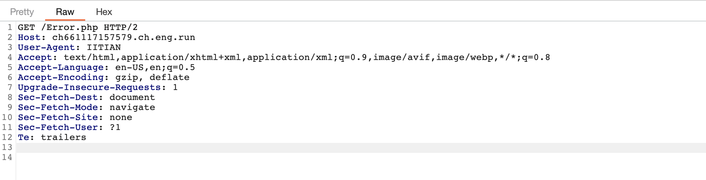
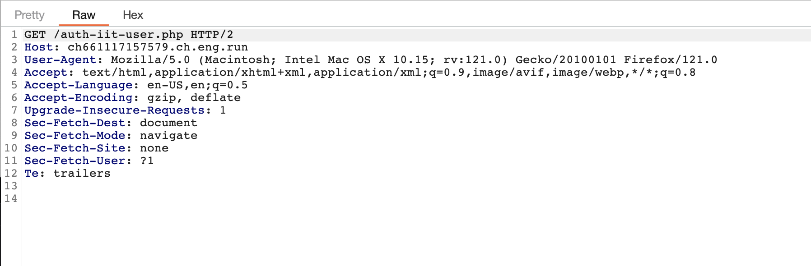
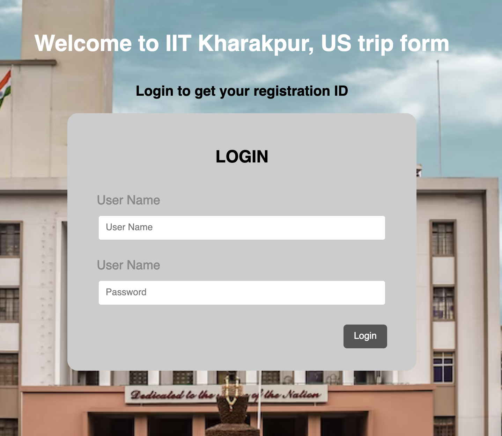
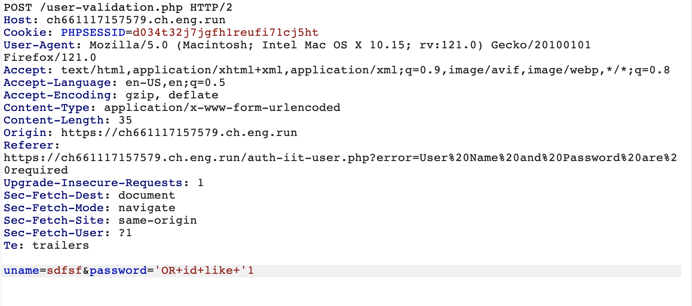
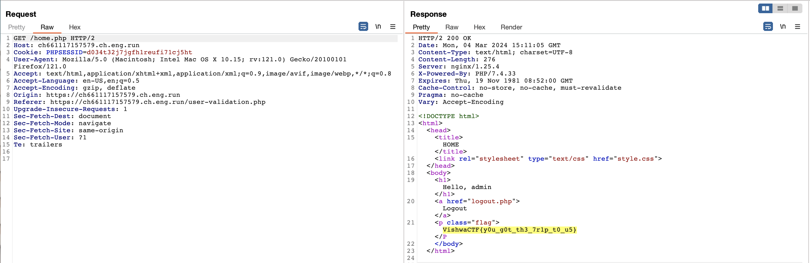

# Trip To Us

## Description

Prepare yourselves for the imminent threat! An aesthetically pleasing army of 128 Robots, armed with AGI capabilities, is on the march to destroy our locality!

## Steps:

1. **Finding the 'Click Me' Button**:
    Locate a website featuring a button labeled 'Click Me'. Upon clicking it, I was redirected to `/Error.php`. However, upon inspecting a hidden div, I discovered instructions instructing me to change the User Agent to 'IITIAN'.

2. **Changing the User Agent**:
    After changing the User Agent to 'IITIAN', I was redirected to another page containing a login form.

3. **Exploiting SQL Injection**:
    Utilizing a SQL injection in the pass parameter, I successfully exploited the vulnerability. Payload used: `'OR id LIKE '1

> Flag: VishwaCTF{y0u_g0t_th3_7r1p_t0_u5}